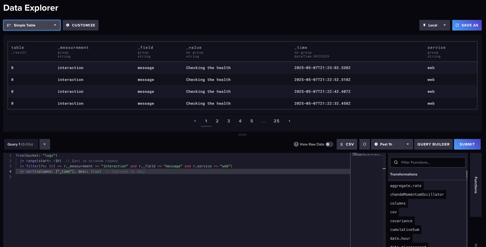
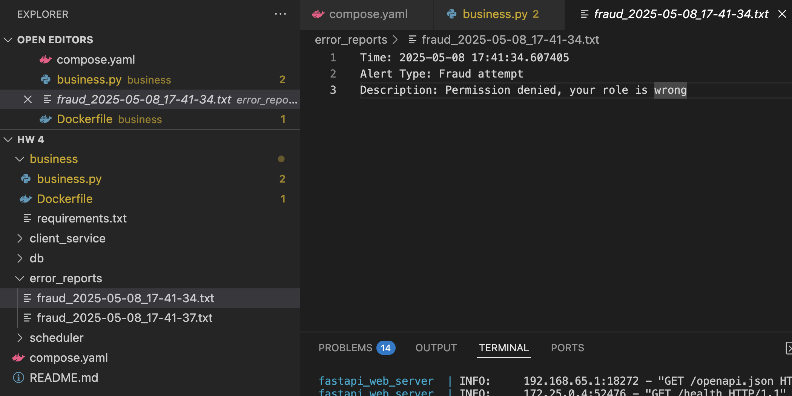

# Homework 4: Alerts, Logs and Celery

Author: **Anastasiia Kucheruk**

## 📝 Description

In this homework, I implemented logging, notifications, and learned how to connect Celery to handle simultaneous requests.

## 🖥 Usage

### How to run the application

1. Clone the repository
2. Open terminal and run ***docker-compose build***
3. Then, run ***docker-compose up***
4. Go to the ***http://localhost:8000/docs*** to check work of the app
5. If you want check logs go to the ***http://localhost:8086/signin***
6. Enter username - *admin* and password - *admin123*

## Results
### Main part
My project consists of two main components - business and scheduler. The business is designed to process requests from customers for recommendations based on your favourite song, as well as to check the health and get a brief description of the module. The scheduler makes a health-check request to the business service every 10 seconds. I have also integrated Celery, which works separately from the main business service and is used to receive recommendations. For a successful Celery integration, I additionally use Redis for the broker and backend
For logging in my app, I used InfluxDB to store logs such as API requests, Celery task statuses, health checks, and system descriptions.
## Logging
In the business block, I added logging for all requests - to check the description, health, get recommendations, and check the result of tasks (Celery). Example below in the screen:

## Alerts
Next, I implemented an alert system, so that if a user wants to receive a recommendation, they need to enter their role. If the role is not 'admin', an alert file is generated (the file is generated in the *error_reports* folder, but if the folder has not been created yet, an additional folder is created). The file contains the time when I receive the alert, its type (in my case, it is Fraud attempt), and a brief description of the alert. You can see an example in the screen:

## Celery
Finally, I implemented Celery to handle background tasks. That is, when I receive a request from a client to get recommendations, a task is launched in Celery, which is queued in Redis. Then the task is executed, has its own ID and result, and at the end you can send a request for the results of the task using its ID.
As in the screen, I post request and received ID and information that my request was sent:

And then I check ID of my task and see that it was failed as my OPEN AI key is incorrect:

## Sync and async functions
My *root*, *health*, and *recommend_song* functions are synchronous because they perform quick tasks that don't require much effort. But the *get_task_result* function is asynchronous, which allows FastAPI to process other requests while this function waits for the result from Celery. Thus, the work of other functions is not blocked

### Resource Scaling Estimation
- 10 simultaneous connections
In my opinion, 10 users is a small load and my current system can handle it. Therefore, there is no need to scale it up.
- 50 simultaneous connections
50 simultaneous connections is already a significant load, and here I need to parallelize the processing of requests. I assume that it is worthwhile to increase the vertical scaling here, i.e. to increase the capacity and possibly add a couple of additional workers. 
- 100 or more simultaneous connections
This is a significant and heavy load on my system, so I definitely need to increase the load here, for example, I can make several instances of the service according to the load and make several workers on different machines, possibly with separate queues. That is, I need to distribute the system as much as possible to be able to process all requests.